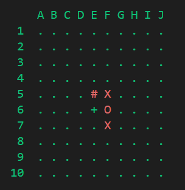

# Project Documentation for EECS 581 Project 1

## 1. Overview

- Project Title: Project 1 Battleship! by: KCBBG
- Purpose: This project allows for two players to play battleship from one device and it also serves as a "warm-up" project for our team to get to know each other and work together for the first time

### 2. Setup

- Clone the repository: `git clone https://github.com/Gianni-Louisa/EECS_581-Project1-BattleShip.git`
- Run the board.py file in a python IDE
- Or run the game in a terminal by navigating to the folder you cloned the repository to

cd path/to/cloned/repo

- And use this command to run the game

python board.py

### 2. Game flow

- The game starts and the progam asks how many ships the players want to battle with
- Player 0 places all of his/her ships and passes it the game to Player 1 and they do the same
- the main game loop begins:
  - Player 0 secretly chooses a coordinate to shoot
    - they are told if they hit, miss or sunk their opponets ship
    - their board reflects any of those results
  - Player 1 secretly chooses a coordinate to shoot
    - they are told if they hit, miss or sunk their opponets ship
    - their board reflects any of those results
- The game ends when a player destroys all of their opponet's ships

### 3. Code Structure

board.py (the main file)

- This file contains the functions required to start the game as well as the main gameplay loop.
  - Functions that take player input
    - Players are asked 3 things: how many ships they are going to play with, thier inputs to place their ships, and their coordinate to shoot
    - goodInput() returns the number of ships the player chooses to use that will be used for the whole game
    - shipPlacement(nShips) takes in the number of ships being used that game and returns the coordinates for each ship of Player 0 and Player 1.
      - the helper function move_line(grid, size, p1_selection) is used to place a valid line on the board
      - the user chooses 'wasd' to move the line in a direction, 'r' to rotate the ship, 'c' to confirm the placement and 'q' to quit
    - shootShip() allows a player to input their desired shot coordinates in the format: column+row (or letter+number. these are not interchangable and there are no spaces). the coordinate of the shot is returned as a string
  - Functions that update the game
    - checkWin() returns True if the game is not over and returns False if somebody wins
    - checkHit(shot: str, enemy: Player) -> None takes in a shot coordinate, and the other player class. Does not return anything. Checks whether a shot is a hit, miss or sink. Also displays the correct message.
  - Funcitons that render the game
    - create_grid(x_size=10, y_size=10) returns a grid full of '.' that is used to initialize a blank board used when the players are placing their ships
    - add_line_to_grid() and add_comfirm_to_grid() are used when a player is placing his/her ship
      - '###' represents the cursor of where their ship will be placed if they confirm
      - '+++' represents a ship the player has already confirmed
    - The player class is responsible for the rest of the rendering of the game as each player keeps track of their own boards
  - Functions that control the flow of the game
    - takeTurn(player: Player, opponent: Player) -> None: this function controls the main game loop of our game
      - identifies whose turn it is and displays the appropriate player's board
      - asks the player to take a shot and displays a message telling them if they hit, miss or sunk a ship
    - main(): is structured exactly how the Game Flow was described using the previously highlighted functions

Player.py

- This file contains the Player class. The most important pieces of the player class are the game boards.
- Each Player class keeps track of two lists. One that contains their ship coordinates and one that contains every coordinate they have guessed.
- printStrikeBoard(self, opponent) -> None: This is the board that is on top that displayes the players guesses and denotes if they were hits, misses, or if the ship is sunk. This board is created using the Player's list of guesses and the opponent's list of ships.
- printBoard(self, opponent) -> None: This is the board that is on the bottom that displayes the players ships and any of the opponents guesses. This board is created using the Player's list of ships and the opponent's list of guesses.

Ship.py

- All a ship does in our game is keep track of its location and what segments have been hit
- ships get added to each players list of ships

Symbol Key:

- '#' a ship was sunk here
- '+' a ship occupies this location
- 'O' a ship was hit here
- 'X' a shot was missied here
- '.' nothing has happened here

#### Recommendations

To the next team that is in charge of our project, It might be worth choosing to get rid of the ship class and ship file completely because all it does at this point is keep track of the ship coordinates which can be confusing (and the ship class's one method is not even used).
